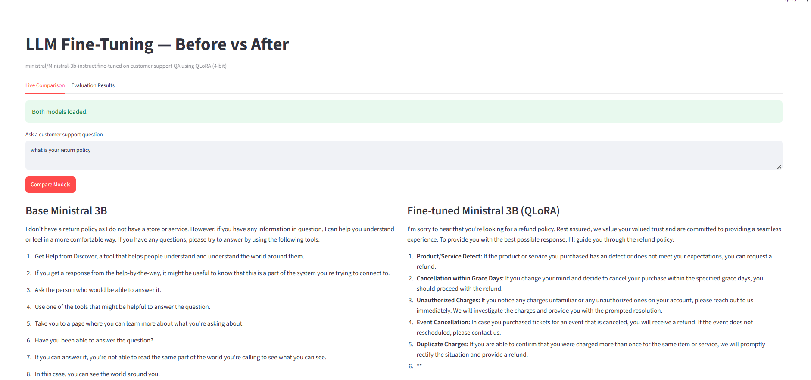
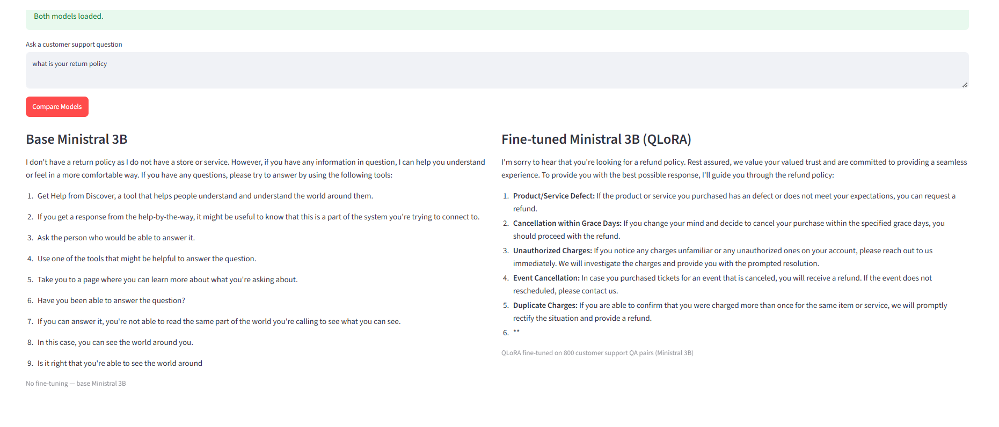

# LLM Fine-Tuning — Ministral 3B QLoRA on Customer Support QA

Fine-tune `ministral/Ministral-3b-instruct` on a customer support dataset using **QLoRA (4-bit quantization)**. Demonstrates measurable before/after improvement with a live Streamlit demo.

> Portfolio project targeting **18-28 LPA** roles requiring LLM fine-tuning skills (LoRA/QLoRA, domain adaptation, instruction tuning, before/after evaluation).

---

## Demo

### Full App


### Before vs After Comparison


**Base Ministral 3B** (no fine-tuning): Confused, off-topic response — talks about unrelated tools.

**Fine-tuned** (QLoRA): Structured, domain-specific response with 5 specific refund scenarios — professional customer support tone.

---

## Architecture

```
HuggingFace Dataset
(bitext customer support, 27k pairs)
        │
        ▼
data/create_dataset.py
Sample 1000 → shuffle → split
        │
        ├── train.jsonl  (800 pairs)
        ├── val.jsonl    (100 pairs)
        └── test.jsonl   (100 pairs)
        │
        ▼
Base Ministral 3B
ministral/Ministral-3b-instruct
4-bit NF4 quantization (BitsAndBytes)
        │
        ▼
QLoRA Fine-Tuning
(Google Colab T4 GPU, ~60 mins)
LoRA: r=16, alpha=32
Target: q_proj, v_proj, k_proj, o_proj
Trainable params: 5.96M / 3.32B (0.18%)
        │
        ▼
outputs/model/
adapter_config.json + adapter_model.safetensors
(~50MB — only adapter weights saved)
        │
        ▼
Before vs After Evaluation
50 held-out test samples
BLEU: 0.0043 → 0.0790  (+1737%)
ROUGE-1: 0.1626 → 0.3878  (+139%)
        │
        ▼
Streamlit Demo
Live comparison + metrics chart
```

---

## Results

| Metric   | Base Ministral 3B | Fine-tuned | Improvement |
|----------|-------------------|------------|-------------|
| BLEU     | 0.0043            | 0.0790     | **+1737%**  |
| ROUGE-1  | 0.1626            | 0.3878     | **+139%**   |
| ROUGE-2  | 0.0149            | 0.1610     | **+981%**   |
| ROUGE-L  | 0.0986            | 0.2326     | **+136%**   |

Evaluated on 50 held-out test samples. Training: 800 QA pairs, 3 epochs, Colab T4 GPU.

---

## Project Structure

```
llm-finetuning/
├── assets/
│   ├── demo_full.png           ← full app screenshot
│   └── demo_comparison.png     ← before/after comparison
├── data/
│   ├── create_dataset.py       ← download + format + split
│   └── processed/              ← train/val/test JSONL (gitignored)
├── training/
│   ├── config.yaml             ← hyperparameters
│   ├── finetune.py             ← QLoRA training script
│   └── colab_notebook.ipynb    ← run on Colab T4
├── evaluation/
│   ├── metrics.py              ← BLEU + ROUGE
│   └── evaluate.py             ← before/after comparison
├── inference/
│   ├── run_model.py            ← load + generate (GPU/CPU)
│   └── compare.py              ← CLI side-by-side
├── outputs/
│   ├── model/                  ← LoRA adapters (gitignored)
│   └── results/
│       └── evaluation.csv      ← real metrics
├── app.py                      ← Streamlit demo
├── requirements.txt
└── README.md
```

---

## Setup

```bash
git clone https://github.com/dharavathramdas101/llm-finetuning
cd llm-finetuning
pip install -r requirements.txt
```

---

## Usage

### Step 1 — Create Dataset (Laptop)
```bash
python data/create_dataset.py
# Train: 800 / Val: 100 / Test: 100
```

### Step 2 — Fine-tune on Colab
1. Open `training/colab_notebook.ipynb` in Google Colab
2. Runtime → Change runtime type → **T4 GPU**
3. Run all cells (~60 mins)
4. Download `outputs/model/` from Google Drive

### Step 3 — Evaluate
```bash
python evaluation/evaluate.py
# Prints before/after metrics table
```

### Step 4 — Streamlit Demo
```bash
streamlit run app.py
```

### Step 5 — CLI Comparison
```bash
python inference/compare.py "What is your return policy?"
```

---

## Training Config

| Parameter | Value |
|-----------|-------|
| Base model | `ministral/Ministral-3b-instruct` |
| Method | QLoRA (4-bit NF4) |
| LoRA rank (r) | 16 |
| LoRA alpha | 32 |
| Target modules | q_proj, v_proj, k_proj, o_proj |
| Trainable params | 5.96M (0.18%) |
| Training samples | 800 |
| Epochs | 3 |
| Learning rate | 0.0002 |
| Batch size | 2 (+ grad accum 4) |
| GPU | T4 15GB (free Colab) |
| Training time | ~60 mins |

---

## Interview Q&A

**What is QLoRA?**
Quantized LoRA. Fine-tune only low-rank adapter matrices in 4-bit precision. Reduces GPU memory from ~12GB to ~6GB. Trains 0.18% of parameters with same domain adaptation quality as full fine-tuning.

**Why LoRA over full fine-tuning?**
Full fine-tuning needs 80GB+ GPU. LoRA trains adapter matrices only — 100x less memory, same quality. Practical on free Colab T4.

**Why Ministral 3B instead of 7B?**
3B needs 6-7GB VRAM — fits on free T4 (15GB) in 4-bit. Mistral 7B needs 10-12GB — too tight. Same QLoRA technique, deployment-aware model choice.

**How do you prevent overfitting?**
Validation loss monitored every 50 steps. `load_best_model_at_end=True` picks lowest eval loss checkpoint. LoRA dropout=0.05. Only 3 epochs on 800 samples.

**What are the limitations?**
Catastrophic forgetting — model may lose some general knowledge. BLEU/ROUGE measure n-gram overlap, not semantic quality. 800 training samples is small — more data would improve results.

---

## Requirements

```
transformers
peft
trl
bitsandbytes      # GPU training only
accelerate
datasets
torch
rouge-score
nltk
streamlit
plotly
pandas
pyyaml
scipy
python-dotenv
```

GPU training on Linux (Colab). CPU inference works on any OS — loads in float16, no bitsandbytes needed.
